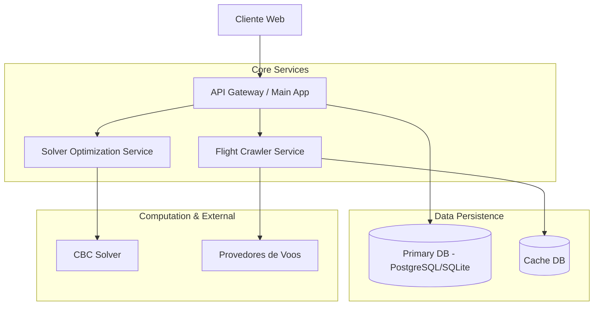

# OptiWay: Plataforma de Otimização Multimodal de Itinerários de Viagem

**Documentação Técnica e Manual do Sistema**

---

## 1. Resumo

O **OptiWay** é um sistema distribuído de suporte à decisão projetado para abordar a complexidade inerente ao Problema de Roteamento de Viagens Multi-Cidades (*Multi-City Travel Routing Problem*). Integrando técnicas avançadas de **Coleta de Dados Heterogêneos** (APIs e Web Scraping) e **Pesquisa Operacional** (Programação Linear Inteira Mista), a plataforma propõe a construção de itinerários multimodais ótimos. O sistema diferencia-se pela capacidade de resolver conflitos entre múltiplos objetivos — minimização de custos financeiros e redução do tempo total de viagem — através de uma abordagem baseada na fronteira de Pareto. A arquitetura de microsserviços assegura escalabilidade, robustez e a desacoplagem necessária para a manutenção de componentes críticos como o *crawler* de voos e o *solver* matemático.

---

## 2. Introdução e Contextualização

> **📘 Guia de Uso**: Para aprender a navegar no sistema, realizar cadastros e simulações, consulte o **[Manual do Usuário Completo](docs/MANUAL_DO_USUARIO.md)**.

O planejamento de itinerários turísticos que envolvem múltiplos destinos, restrições orçamentárias e janelas temporais rígidas é um problema combinatorial de alta complexidade, classificado na literatura como NP-Difícil. Mecanismos de busca convencionais (OTAs) operam predominantemente com lógica ponto-a-ponto, falhando em capturar as interdependências entre múltiplos trechos de uma viagem complexa.

O **OptiWay** preenche esta lacuna modelando a viagem como um grafo direcionado ponderado, onde o objetivo não é apenas encontrar o menor custo para uma aresta individual, mas sim minimizar o custo generalizado de um ciclo ou caminho hamiltoniano que satisfaça um conjunto de restrições de fluxo, tempo e visitação obrigatória.

---

## 3. Metodologia e Abordagem Teórica

O funcionamento do sistema baseia-se em um *pipeline* de processamento de dados rigoroso, dividido em aquisição, normalização e otimização.

### 3.1 Camada de Aquisição e Percepção de Dados
O subsistema de **Crawlers** implementa uma estratégia híbrida para a construção da base de dados de voos e acomodações:
*   **Integração Determinística (Amadeus API)**: Acesso estruturado a GDS (Global Distribution Systems) para obtenção de dados de referência.
*   **Coleta Heurística (Web Scraping)**: Utilização de agentes autônomos (via Playwright) para emular interações humanas em agregadores públicos (Google Flights, Kayak), permitindo a captura de tarifas promocionais e combinações não listadas em APIs padrão.
*   **Identificação de Atributos Críticos**: Extração e persistência de metadados essenciais, incluindo *Deep Links* para reserva direta, garantindo a acionabilidade da solução proposta.

### 3.2 Motor de Otimização (Solver Engine)
O núcleo decisório do sistema é fundamentado na modelagem matemática do **Problema do Caixeiro Viajante Assimétrico (ATSP)**, estendido com restrições de janelas de tempo.

A formulação MILP (*Mixed-Integer Linear Programming*) busca minimizar a função objetivo $Z$:
$$ \min Z = \sum_{i,j} x_{i,j} \cdot (\alpha \cdot C_{i,j} + \beta \cdot T_{i,j}) $$

Onde:
*   $x_{i,j}$: Variável de decisão binária (1 se o arco $i \to j$ é escolhido, 0 caso contrário).
*   $C_{i,j}$ e $T_{i,j}$: Custo e Tempo associados à transição entre os nós $i$ e $j$.
*   $\alpha, \beta$: Pesos de ponderação definidos pelo usuário.

O sistema utiliza o algoritmo **Branch-and-Cut** (implementado via biblioteca PuLP e solver CBC) para garantir a convergência para o ótimo global ou para demonstrar a inviabilidade do conjunto de restrições.

### 3.3 Robustez e Tratamento de Inviabilidade
Reconhecendo a estocasticidade e as falhas inerentes à malha aérea, o sistema implementa mecanismos de resiliência:
*   **Arestas Sintéticas (Modal Terrestre)**: Geração automática de conexões terrestres (via Distância de Haversine) para trechos curtos onde voos diretos inexistem.
*   **Persistência de Resultados Parciais**: Em cenários de inviabilidade matemática ("Infeasible"), o sistema preserva e apresenta soluções parciais, alternativas sub-ótimas e fragmentos de itinerários (hotéis, carros) para auxiliar a tomada de decisão manual pelo usuário.

---

## 4. Arquitetura de Software

O sistema adota uma arquitetura orientada a serviços (SOA), facilitando a manutenção e a evolução independente dos módulos.



### Componentes Principais
1.  **Main App (Orchestrator)**: Responsável pela gestão de estado, autenticação e composição de respostas. Gerencia o histórico de buscas e a visualização de rotas (feitas e infactíveis).
2.  **Solver Service**: Microsserviço CPU-bound isolado para execução dos algoritmos de otimização combinatória.
3.  **Flight Crawler**: Microsserviço I/O-bound responsável pela navegação e raspagem de dados em tempo real.

---

## 5. Procedimentos de Instalação e Execução

O sistema foi projetado para portabilidade, suportando execução via containerização ou em ambiente virtual Python padrão.

### 5.1 Pré-requisitos
*   **Docker Engine** & **Docker Compose** (Recomendado para orquestração completa).
*   Alternativamente: Python 3.12+, `pip` e `venv`.

### 5.2 Execução via Docker (Ambiente de Produção/Homologação)
O orquestrador `docker-compose` gerencia o ciclo de vida de todos os serviços e dependências.

```bash
# Construção e inicialização dos serviços
docker compose up --build -d
```
O sistema estará disponível em:
*   **Frontend/API**: `http://localhost:8000`
*   **Health Checks**: `http://localhost:8000/health`

### 5.3 Execução Manual (Ambiente de Desenvolvimento)

**1. Instalação de Dependências**
```bash
pip install -r requirements.txt
pip install -r flight_crawler/requirements.txt
# Instalação dos binários do navegador para o Crawler
python -m playwright install
```

**2. Inicialização dos Serviços**
Recomenda-se a execução em terminais distintos:

*Terminal 1 (Main App):*
```bash
uvicorn main:app --host 0.0.0.0 --port 8000 --reload
```

*Terminal 2 (Flight Crawler):*
```bash
uvicorn flight_crawler.main:app --host 0.0.0.0 --port 8001 --reload
```

*Terminal 3 (Solver Service):*
```bash
uvicorn solver_service.main:app --host 0.0.0.0 --port 8002 --reload
```

---

## 6. Documentação Detalhada dos Subsistemas (API Reference)

Para uma compreensão aprofundada da implementação e dos contratos de interface de cada módulo, consulte a documentação específica abaixo. Cada subsistema possui um papel distinto na arquitetura distribuída:

### 6.1 Main Service (Orquestrador e Gateway)
Atua como o ponto de entrada e controlador da aplicação. É responsável pela autenticação de usuários, gestão de sessões, persistência de histórico e, crucialmente, pela orquestração das chamadas aos serviços de *crawling* e *solving*.
*   **Foco**: Regras de negócio, Gestão de Estado, API Gateway.
*   **Consulte a especificação completa**: [📄 docs/main-service.md](docs/main-service.md)

### 6.2 Flight Crawler Service (Camada de Percepção)
O "olho" do sistema. Este serviço encapsula a complexidade de extrair dados de diversas fontes externas (Amadeus, Google Flights, Kayak, etc.). Ele normaliza dados heterogêneos em uma estrutura canônica (`Flight`, `Hotel`, `CarRental`) para consumo pelo restante do sistema.
*   **Foco**: Web Scraping, Integração de APIs de terceiros, Normalização de Dados.
*   **Consulte a especificação completa**: [📄 docs/flight-crawler-service.md](docs/flight-crawler-service.md)

### 6.3 Solver Service (Motor de Otimização)
O "cérebro" matemático. Recebe um grafo ponderado e aplica algoritmos de Pesquisa Operacional para encontrar a solução ótima. Isolado para permitir escalabilidade vertical independente, dado seu caráter computacionalmente intensivo (CPU-bound).
*   **Foco**: Modelagem Matemática, Algoritmos Exactos (Branch-and-Cut), Heurísticas.
*   **Consulte a especificação completa**: [📄 docs/solver-service.md](docs/solver-service.md)

---

## 7. Referências Bibliográficas

1.  **Miller, C. E., Tucker, A. W., & Zemlin, R. A.** (1960). *Integer programming formulation of traveling salesman problems*. Journal of the ACM.
2.  **Dantzig, G. B., Fulkerson, D. R., & Johnson, S. M.** (1954). *Solution of a large-scale traveling-salesman problem*. Operations Research.
3.  **Toth, P., & Vigo, D.** (2014). *Vehicle Routing: Problems, Methods, and Applications*. SIAM.
