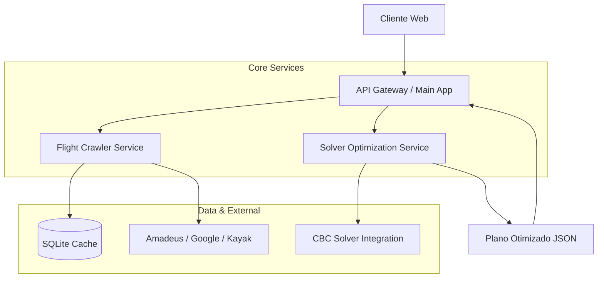

# OptiWay: Plataforma de Otimização Multimodal de Itinerários de Viagem

**Documentação Técnica e Manual do Sistema**

---

## 1. Resumo Executivo

O **OptiWay** é um sistema distribuído de suporte à decisão projetado para resolver problemas complexos de roteamento turístico. Através da integração de técnicas de **Inteligência Artificial** (Web Crawling e Processamento de Dados) e **Pesquisa Operacional** (Programação Linear Inteira Mista), a plataforma constrói itinerários multimodais ótimos, equilibrando as funções objetivo conflitantes de minimização de custo financeiro e minimização de tempo total de viagem.

A arquitetura do sistema segue o padrão de microsserviços, garantindo escalabilidade, desacoplamento e manutenção eficiente de seus componentes críticos: coleta de dados, otimização matemática e interface de usuário.

---

## 2. Fundamentação Teórica e Funcionamento

O fluxo de processamento do sistema é estruturado em quatro estágios sequenciais, desenhados para transformar dados brutos não estruturados em planos de viagem acionáveis e matematicamente otimizados.

### 2.1 Coleta e Normalização de Dados (Data Acquisition Layer)
O subsistema de **Crawlers** atua como a camada de percepção da plataforma, responsável pela aquisição de dados de mercado em tempo real. Implementa uma estratégia híbrida:
*   **Integração via API (Amadeus)**: Para acesso determinístico e estruturado a inventários globais de companhias aéreas e redes hoteleiras.
*   **Web Scraping (Playwright/Selenium)**: Emula o comportamento humano para extrair dados de fontes públicas (Google Flights), garantindo a amplitude da busca.
*   **Persistência e Cache**: Implementa uma camada de cache local (SQLite) com política de expiração (TTL de 24 horas), mitigando a latência de rede e reduzindo custos operacionais de chamadas de API.

### 2.2 Otimização Multimodal (Multimodal Reasoning)
Diferenciando-se de agregadores convencionais, o OptiWay incorpora lógica geoespacial avançada:
*   **Geração de Arestas Sintéticas**: Identifica a inexistência de conexões aéreas diretas e calcula, via Distância de Haversine e APIs de roteamento, a viabilidade de conexões terrestres (transfer/carro alugado) entre nós vizinhos (ex: raio de 400km).
*   **Grafo de Transporte Unificado**: Constrói um supergrafo onde vértices representam cidades/aeroportos e arestas representam voos ou trajetos terrestres, permitindo a otimização simultânea de diferentes modais.

### 2.3 Otimização Combinatória (Solver Engine)
O núcleo decisório do sistema baseia-se em modelagem matemática rigorosa:
*   **Modelo**: Variação do Problema do Caixeiro Viajante Assimétrico (ATSP) com janelas de tempo e restrições de obrigatoriedade.
*   **Formulação**: Programação Linear Inteira Mista (MILP), implementada através da biblioteca **PuLP**.
*   **Função Objetivo ($Z$)**:
    $$ \min Z = \sum (w_c \cdot Custo + w_t \cdot Tempo) $$
    Onde $w_c$ e $w_t$ são os pesos normalizados definidos pelo usuário, permitindo a construção da fronteira de Pareto entre economia e rapidez.
*   **Algoritmo**: Branch-and-Cut (via solucionador CBC), garantindo a otimalidade global ou o melhor gap de integridade possível dentro do tempo limite.

### 2.4 Interface e Experiência do Usuário (Presentation Layer)
*   **Dashboard Interativo**: Desenvolvido sobre **FastAPI** e templates Jinja2, oferece uma UX responsiva para definição de parâmetros de otimização.
*   **Visualização de Dados**: Emprega bibliotecas como Leaflet.js para renderização geoespacial das rotas e plotagem gráfica das componentes de custo.

---

## 3. Arquitetura de Software

A solução adota uma arquitetura orientada a serviços (SOA) moderna.



### Componentes do Sistema
| Componente | Função Técnica | Tecnologias Chave |
| :--- | :--- | :--- |
| **Main App** | Orquestração, Auth, Gateway e UI | FastAPI, Jinja2, JWT |
| **Flight Crawler** | Extração e normalização de dados | Playwright, BeautifulSoup, Pandas |
| **Solver Service** | Modelagem matemática e resolução | PuLP, NumPy, SciPy |

---

## 4. Estrutura do Repositório

Organização lógica do código-fonte seguindo padrões de engenharia de software Python.

- `app/`: Aplicação Principal
    - `api/`: Definição de rotas e controladores.
    - `db/`: Modelos ORM (SQLAlchemy) e esquemas de banco de dados.
    - `services/`: Lógica de negócio e adaptadores de serviço.
    - `templates/`: Camada de visualização (HTML/CSS/JS).
- `flight_crawler/`: Microsserviço de Coleta de Dados
    - `scrapers/`: Implementações específicas de scrapers (Design Pattern Strategy).
- `solver_service/`: Microsserviço de Otimização
    - `models/`: Formulações matemáticas PuLP.
- `docs/`: Documentação técnica detalhada dos serviços.

---

## 5. Procedimentos de Instalação e Execução

O sistema suporta implantação via contêineres (recomendado para reprodutibilidade) ou execução direta em ambiente virtual Python.

### 5.1 Pré-requisitos
*   Docker Engine & Docker Compose (Recomendado)
*   Ou Python 3.10+ com `pip` e `venv`.

### 5.2 Execução Containerizada (Docker)

O arquivo `docker-compose.yml` orquestra o ciclo de vida de todos os microsserviços.

```bash
# Compilar e iniciar os serviços em background
docker compose up --build -d
```

**Endereçamento dos Serviços:**
*   Main App (UI & Gateway): `http://localhost:8000`
*   Flight Crawler Service: `http://localhost:8001`
*   Solver Service: `http://localhost:8002`

### 5.3 Execução Manual (Desenvolvimento)

Para depuração ou desenvolvimento isolado de componentes:

**1. Main App (Backend):**
```bash
pip install -r requirements.txt
uvicorn main:app --host 0.0.0.0 --port 8000 --reload
```

**2. Flight Crawler:**
```bash
pip install -r flight_crawler/requirements.txt
python -m playwright install --with-deps  # Instalação de binários de navegador
uvicorn flight_crawler.main:app --host 0.0.0.0 --port 8001 --reload
```

**3. Solver Service:**
```bash
# Compartilha dependências base
uvicorn solver_service.main:app --host 0.0.0.0 --port 8002 --reload
```

---

## 6. Documentação Detalhada dos Subsistemas (API Reference)

Para uma compreensão aprofundada da implementação e dos contratos de interface de cada módulo, consulte a documentação específica abaixo. Cada subsistema possui um papel distinto na arquitetura distribuída:

### 6.1 Main Service (Orquestrador e Gateway)
Atua como o ponto de entrada e controlador da aplicação. É responsável pela autenticação de usuários, gestão de sessões, persistência de histórico e, crucialmente, pela orquestração das chamadas aos serviços de *crawling* e *solving*.
*   **Foco**: Regras de negócio, Gestão de Estado, API Gateway.
*   **Consulte a especificação completa**: [📄 docs/main-service.md](docs/main-service.md)

### 6.2 Flight Crawler Service (Camada de Percepção)
O "olho" do sistema. Este serviço encapsula a complexidade de extrair dados de diversas fontes externas (Amadeus, Google Flights, Kayak, etc.). Ele normaliza dados heterogêneos em uma estrutura canônica (`Flight`, `Hotel`, `CarRental`) para consumo pelo restante do sistema.
*   **Foco**: Web Scraping, Integração de APIs de terceiros, Normalização de Dados.
*   **Consulte a especificação completa**: [📄 docs/flight-crawler-service.md](docs/flight-crawler-service.md)

### 6.3 Solver Service (Motor de Otimização)
O "cérebro" matemático. Recebe um grafo ponderado e aplica algoritmos de Pesquisa Operacional para encontrar a solução ótima. Isolado para permitir escalabilidade vertical independente, dado seu caráter computacionalmente intensivo (CPU-bound).
*   **Foco**: Modelagem Matemática, Algoritmos Exactos (Branch-and-Cut), Heurísticas.
*   **Consulte a especificação completa**: [📄 docs/solver-service.md](docs/solver-service.md)

---

> **Nota Acadêmica**: Desenvolvido sob a ótica de Sistemas de Informação Distribuídos e Pesquisa Operacional Aplicada. Consulte a pasta `docs/` para especificações formais de cada subsistema.
