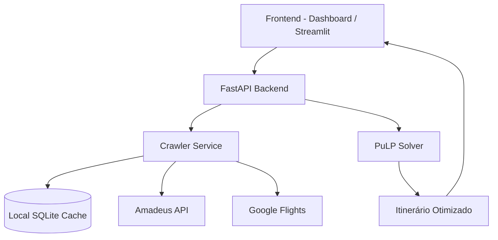

# 🌍 Travel Optimizer - Manual do Sistema

O **Travel Optimizer** é uma plataforma avançada de planejamento de viagens que utiliza inteligência artificial e otimização matemática para encontrar o roteiro perfeito, equilibrando **custo** e **tempo**.

---

## 🚀 Como o Sistema Funciona?

O sistema opera em um fluxo de quatro etapas principais:

### 1. Coleta de Dados (Crawlers)
Quando você solicita um roteiro, o sistema ativa "robôs" de busca (**Crawlers**) que consultam preços em tempo real:
- **Amadeus API**: Conecta-se diretamente aos sistemas das companhias aéreas e redes de hotéis.
- **Google Flights**: Simula buscas via navegador (Selenium) para obter preços de voos públicos.
- **Cache Inteligente**: Resultados de buscas anteriores são armazenados localmente (SQLite) por 24 horas para garantir respostas instantâneas e economizar chamadas de API.

### 2. Otimização Híbrida (Voo + Solo)
Diferente de buscadores comuns, o Travel Optimizer entende a geografia:
- Se um destino não possui aeroporto (ex: Ituiutaba), o sistema calcula automaticamente o trajeto de **carro alugado** a partir do aeroporto mais próximo (ex: Uberlândia).
- Ele combina voos e trechos terrestres no mesmo itinerário final.

### 3. O "Cérebro" (Solver Matemático)
O coração do sistema é um modelo de **Otimização Linear Inteira** construído com a biblioteca **PuLP**. 
- O problema é modelado como uma variação do "Problema do Caixeiro Viajante" (TSP).
- **Função Objetivo**: O sistema busca minimizar um valor calculado pelo peso que você definiu:
  - `Escore = (Peso_Custo * Gasto_Total) + (Peso_Tempo * Duração_Total)`
- **Restrições**: O Solver garante que você visite todas as cidades obrigatórias, respeite a quantidade de dias de estadia e retorne (se solicitado) à cidade de origem.

### 4. Interface do Usuário (UI)
- **FastAPI Dashboard**: Uma interface web moderna e rápida (usando Bootstrap) onde você configura passageiros, datas e pesos.
- **Streamlit App**: Uma alternativa visual para análise detalhada de logs e depuração do motor de busca.
- **Visualização**: Mapas interativos (Leaflet) mostram sua rota, enquanto cartões detalham o custo de cada etapa.

---

## 🛠️ Opções Detalhadas

| Opção | Descrição |
| :--- | :--- |
| **Origens e Destinos** | Você pode sair de múltiplas cidades e visitar diversos destinos em uma única viagem. |
| **Cidades Obrigatórias** | Garante que o roteiro inclua paradas específicas, mesmo que não sejam o destino final. |
| **Adultos/Crianças** | Ajusta o custo total das passagens e diárias por pessoa. |
| **Custo vs Tempo** | Um slider que define sua prioridade. 100% Custo focará no mais barato (mesmo com conexões longas). 100% Tempo focará no mais rápido. |
| **Buscar Hotéis** | Quando ativo, o sistema busca hotéis reais nas cidades de destino e inclui as diárias no cálculo de custo. |
| **Alugar Carro** | Quando ativo, o sistema busca custos de aluguel e os utiliza para decidir se vale mais a pena dirigir ou voar entre cidades próximas. |
| **Dados Mock (Teste)** | Permite testar o sistema sem gastar créditos de API real, gerando dados fictícios rápidos. |

---

## 🏗️ Arquitetura Técnica

---

## 📂 Estrutura de Pastas

- `app/api/`: Endpoints do backend.
- `app/services/solver_service.py`: Lógica matemática da otimização.
- `app/templates/`: Arquivos HTML da interface web.
- `data/crawler.py`: Motores de busca de dados reais.
- `data/database.py`: Gerenciamento do cache local.

---

> [!TIP]
> Para obter os melhores resultados, use pesos equilibrados (ex: 70% Custo, 30% Tempo) para evitar conexões excessivamente longas apenas para economizar poucos reais.

## Colocar para rodar em docker