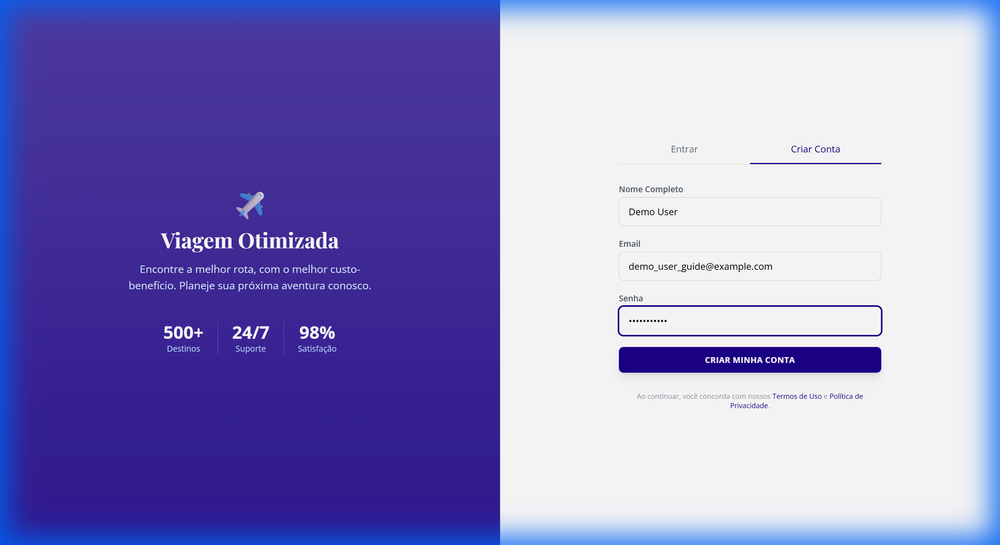
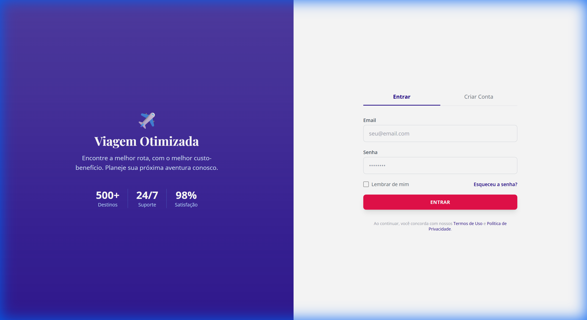

# Manual do Usuário - OptiWay

Bem-vindo ao guia oficial de utilização do sistema **OptiWay**. Este documento detalha, passo a passo, como navegar na plataforma, realizar cadastros, configurar otimizações complexas e interpretar os resultados.

---

## 1. Cadastro e Acesso

O sistema conta com um módulo de autenticação seguro. Ao acessar a URL principal (ex: `http://localhost:8000`), você verá a tela de Login.

### 1.1 Criando uma Nova Conta
Para novos usuários, o cadastro é simples e rápido:
1. Clique na aba **"Cadastre-se"** localizada no topo do formulário.
2. Preencha os campos obrigatórios:
    *   **Nome Completo**: Para identificação no sistema.
    *   **Email**: Seu identificador único de acesso.
    *   **Senha**: Crie uma senha segura.
3. Clique no botão **"Criar Minha Conta"**.

*Figura 1: Formulário de cadastro preenchido com dados de exemplo.*

---

### 1.2 Realizando Login
Caso já possua cadastro, utilize a aba **"Entrar"**:
1. Insira seu **Email** e **Senha**.
2. Clique em **"Entrar"**.

*Figura 2: Tela de login padrão do sistema.*

---

## 2. Dashboard de Planejamento

Após o login, você será direcionado ao **Dashboard**. Esta é a central de comando onde você define os parâmetros da sua viagem. O design foi pensado para ser limpo e intuitivo.

*Figura 3: Visão geral do Dashboard antes de iniciar uma busca.*

### Configurando sua Viagem
No painel lateral esquerdo (ou superior em dispositivos móveis), você encontrará os seguintes filtros:

1.  **Cidades de Origem**:
    *   Insira o código IATA (ex: `SAO`, `JFK`, `LIS`) ou o nome da cidade.
    *   O sistema suporta múltiplas origens para comparar custos de saída.
2.  **Cidades de Destino**:
    *   Liste todas as cidades que deseja visitar. O sistema calculará a melhor rota entre elas.
3.  **Datas**:
    *   Selecione a data de início da viagem.
4.  **Passageiros**:
    *   Ajuste o número de Adultos e Crianças.
5.  **Preferências de Otimização (Sliders)**:
    *   **Peso Preço**: Aumente para priorizar economia.
    *   **Peso Tempo**: Aumente para priorizar voos mais curtos e diretos.

Após configurar, clique no botão **"Otimizar Roteiro"** (ícone de lupa/avião).

> **Nota**: O processo pode levar alguns segundos, pois o sistema está consultando dados reais em diversas fontes (cias aéreas, hotéis, etc).

---

## 3. Análise de Resultados e Itinerários

O OptiWay diferencia-se pela capacidade de lidar com cenários complexos.

### 3.1 Itinerário Otimizado (Sucesso)
Quando uma rota ótima é encontrada, o sistema exibe:
*   **Cronograma Detalhado**: Ordem das cidades a visitar.
*   **Voos Específicos**: Detalhes de voos, horários e companhias.
*   **Custo Total**: Soma de passagens, hotéis e transporte.

### 3.2 Tratamento de Inviabilidade (Rotas Alternativas)
Em alguns casos, não existem voos diretos entre as cidades escolhidas nas datas solicitadas. Ao invés de apenas retornar um erro, o OptiWay sugere **soluções multimodais**.

Exemplo prático:
*   Se você tentar buscar voos para uma rota sem cobertura aérea direta naquela data.
*   O sistema exibirá um aviso de "Infeasible" (Inviável via aéreo puro).
*   Automaticamente, ele sugerirá: **"Voe para [Cidade Vizinha] e pegue o transporte terrestre."**

*Figura 4: Exemplo de resposta inteligente do sistema quando não há voo direto, sugerindo rota alternativa.*

---

## 4. Histórico de Viagens

Não perca suas pesquisas! Acesse o menu **"Minhas Viagens"** na barra de navegação superior.
*   O sistema salva automaticamente todas as suas simulações.
*   Você pode revisitar orçamentos antigos e comparar com novas buscas.

---

## 5. Suporte

Caso encontre problemas ou tenha dúvidas sobre rotas específicas, entre em contato com o administrador do sistema.
